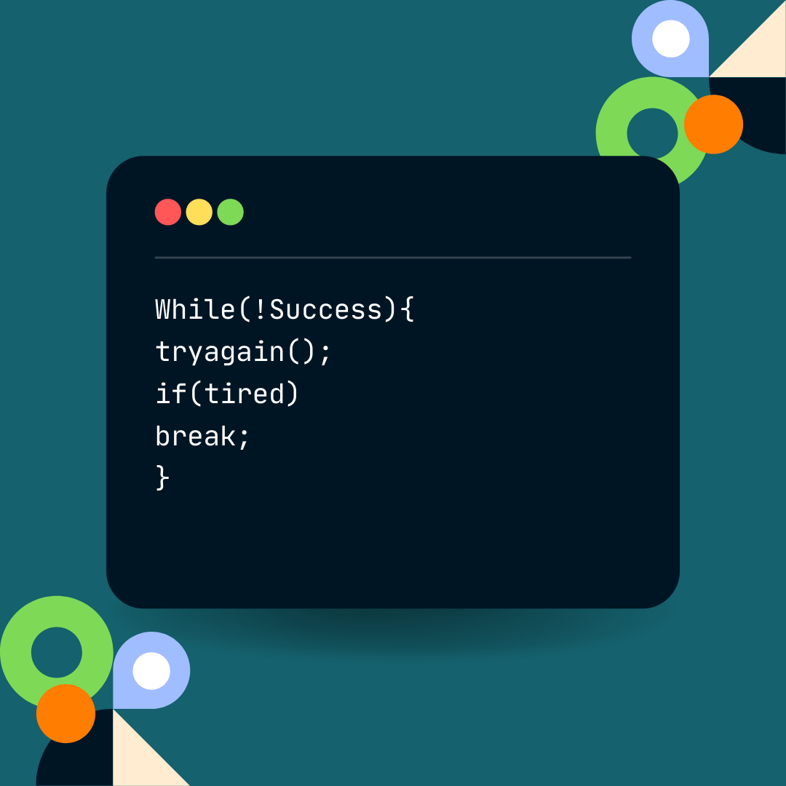

  

  <kbd>

    </kbd>

- 🔭 I’m currently working on : <b>Music recommendation system</b>
- 🌱 I’m currently learning : <b>Deep learning, Android app development</b>
- 💬 Ask me about : <b>Backend development</b>
- 📫 How to reach me: <b>chandolkarshreyas001@gmail.com</b>

  

  <b>Languages and tools:</b>

	
	
	
	
 	
	
	
	 
	
	
	
	
	
	
	
	
	
  

 

 

  

<b>Connect with me:</b>

	

<table align="center">
  <tr>
 

  </tr>
  <tr align="center">

  </tr>
</table>

- ⚡ Thought: 

  <kbd>
</img>
  </kbd>

 © 2022 Shreyas, Made with ❤️ . 

