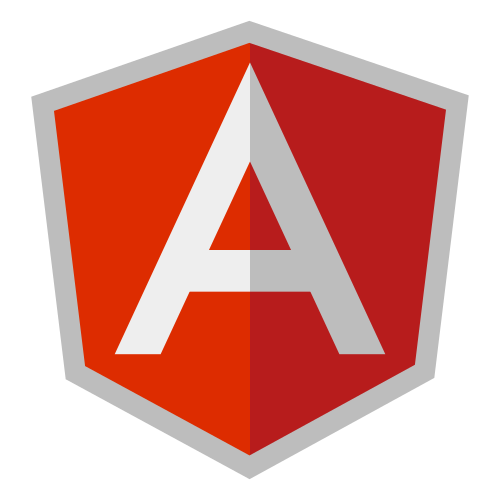

<p align="justify">
<h4>Hi! I'm a versatile developer passionate about software development and robotics.</h4>
</p>

- Current research interests: Robotics and Computer Networks
- Learning: ESP-IDF and GO 
 
 <p>Open to collaborating on interesting projects.</p>
 
```
email-to: chandolkarshreyas001@gmail.com
```
<br/>
<p align="center" >
  <b>Languages and tools:</b>
</p>

<p align="center">
	
	
	
	
	
	
	
	
	
	
	
	
	
	
	
	
	
	
	
	
	
	
  	
  	
  	
  	
  	
  	
  	
</p>
<br/><br/>

<!-- <div align = "center">

[](https://github.com/ryo-ma/github-profile-trophy)

</div> -->

	


<!-- 
<p align="center">
<table align="center">
  <tr>
 

  </tr>
  <tr align="center">

  </tr>
</table>
<p> -->
<!-- <p align="center"></p> -->


<p align="center"></p>
<p align="center"></p>
<p align="center"></p>
<p align="center"></p>


<b>Connect with me:</b>

[](https://github.com/Chandolkar001)
[](https://www.instagram.com/shreyasc_01/)
[](https://www.linkedin.com/in/shreyas-chandolkar-056847214/)

 <br>

<p align="center"> © 2022 Shreyas, Made with ❤️ . </p>


